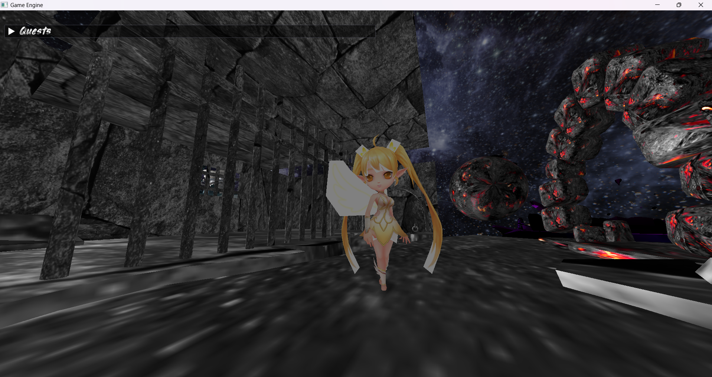
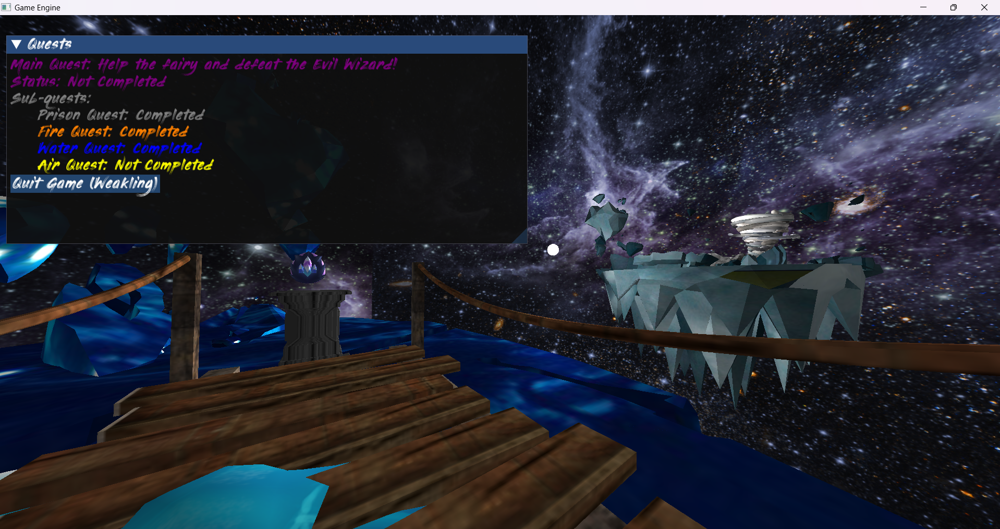
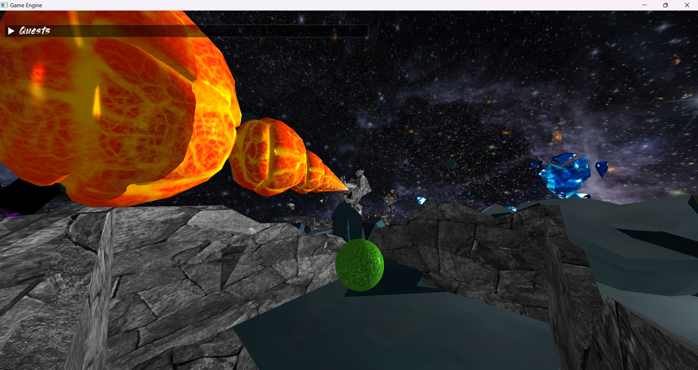
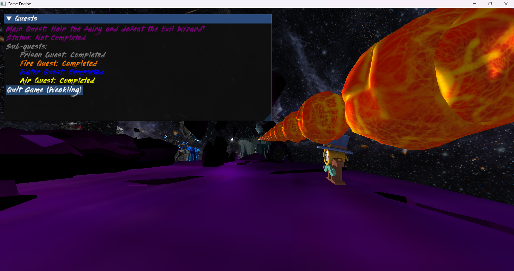

# Avalon: Elemental Dragon's Odyssey🐉

## :rocket: Introduction - Storyline

Embark on a thrilling journey as Avalon, a young and spirited dragon, in "Avalon: Elemental Dragon's Odyssey." Trapped in a world ensnared by an evil sorcerer's grip, Avalon must venture through four elemental realms—water, fire, wind, and earth—to restore balance and reclaim the stolen powers of the fairies. Dive into an immersive narrative filled with unexpected twists and poignant moments, culminating in an epic showdown against the malevolent sorcerer in a fight for the goodwilled fairies...if you could even call them that?

## :world_map: Levels Overview

Embark on a journey through the diverse realms of "Avalon: Elemental Dragon's Odyssey," each nestled as islands within the same galaxy. Begin your adventure in the Prison, where you'll navigate through an introductory tutorial to familiarize yourself with game mechanics. Delve into the scorching challenges of the Fire Forge, followed by the tranquil yet perilous Pond of the Water Realm. Feel the winds of change in The Hurricane, set in the dynamic Wind Realm, before facing the ultimate test in Z’Olreth’s Lair, an underground Earth Realm where the final showdown awaits. Complete the challenges in each island to unlock the next, and witness the unfolding of Avalon's epic adventure across the galaxy.




## :video_game: Player Movements and Mechanics

In "Avalon: Elemental Dragon's Odyssey," players experience a first-person RPG adventure as Avalon, the dragon. Use the `WASD` keys to navigate Avalon through the enchanting realms. Interact with objects and elements using the E key, such as opening prison doors, lighting torches, and collecting dragon eggs. 
Engage in combat by spitting fire with the `Q` key to defeat enemies and restore balance to the elemental realms.🔥
Additionally, a user-friendly GUI provides hints and updates quests based on your progress, ensuring a seamless and immersive gaming experience. Master these movements and mechanics to guide Avalon through their epic quest.



## :wrench: Framework and Implementation Details

"Avalon: Elemental Dragon's Odyssey" is built using **OpenGL**, a powerful cross-platform graphics API commonly used for rendering 2D and 3D graphics. Written in **C/C++**, OpenGL provides developers with low-level access to graphics hardware, allowing for high-performance rendering and real-time graphics applications.

The game's camera movement is implemented in [`camera.cpp`](GameEngine/Camera) and [`camera.h`](GameEngine/Camera), providing players with smooth and intuitive control over Avalon's perspective within the immersive worlds. This functionality enhances the player's experience, allowing for seamless exploration and interaction with the environment.

To enhance the user interface and provide helpful hints and quest updates, the **ImGui** library is utilized, offering a versatile and customizable GUI system that integrates seamlessly with OpenGL applications.

Incorporating 3D models and textures sourced from websites like **Sketchfab**, **CGTrader**, and **TurboSquid**, the game's assets are stored in the *Resources* folder, organized into *Models* and *Textures* subfolders. These assets are loaded into the game using [`mesh.cpp`](GameEngine/Model Loading) and [`loadObjMesh.cpp`](GameEngine/Model Loading), allowing for immersive environments.

Lighting within the game is handled by the [`shader.cpp`](GameEngine/Shaders) files and **GLSL** shaders located in the *Shaders* folder. These components work together to create dynamic lighting effects, adding realism to the elemental realms Avalon traverses.

## :book: Game Lore

"Avalon: Elemental Dragon's Odyssey" unfolds on the distant planet known as **Drakonia**, nestled among the stars of the cosmos. This world is inhabited by majestic dragons, each possessing unique elemental breath abilities. However, Drakonia's balance is disrupted when a group of mischievous pixies from a neighboring star system spill into the realm through a cosmic anomaly. These pixies, harboring great magical powers, seek to consume Drakonia, transforming it into a whimsical realm filled with enchanted forests and sparkling waters.

The lone observer of these events is **Z'Olrath** 🔮, a cosmic wanderer from the planet Xylothar. Witnessing Drakonia's plight, Z'Olrath embodies the magic of the pixies within himself to prevent the planet's destruction. However, this transformation comes with its challenges, as the pixie magic deems anything it touches as "bad" or "corrupt."



Meanwhile, a unique baby dragon named **Avalon** hatches, imbued with a special connection to the elemental powers by the pixies' magic. Recognizing Avalon's potential threat, the pixies seal him in a dragon jail, spinning an elaborate tale to manipulate him into believing Z'Olrath is the true villain.

As Avalon grows and escapes his prison, he becomes entangled in the pixies' deception, learning to wield elemental powers under their guidance. However, a confrontation with Z'Olrath reveals the truth, forcing Avalon to choose between the pixies and the true path of righteousness. The fate of Drakonia hangs in the balance as Avalon grapples with his allegiance and discovers the true meaning of his elemental powers.



## :mega: Conclusion

"Avalon: Elemental Dragon's Odyssey" was developed as part of the final project for the Advanced Computer Graphics course at The National University of Science and Technology Politehnica Bucharest (UNSTPB). This project provided an opportunity to apply theoretical knowledge and practical skills in game development, OpenGL programming, and graphics rendering. Through the creation of this engaging game, I aimed to demonstrate proficiency in graphics programming techniques, including camera movement, GUI implementation, asset loading, and shader usage. Moreover, the game serves as a testament to the creativity within the realm of computer graphics, offering players a captivating journey through the enchanting world of Drakonia.

## :video_game: How to Play🐲

To play "Avalon: Elemental Dragon's Odyssey," follow these steps:

1. **Clone the Repository**: 
   ```bash
   git clone https://github.com/maruwu8/Avalon-Elemental-Dragon's-Odyssey-RPG-Game.git
   
2. Open GameEngine.sln: Navigate to the cloned repository and open the GameEngine.sln file using an IDE like Visual Studio.

3. Build and Run: Build the solution in your IDE and run the game. It may take some time for all the assets and objects to load, so please be patient.

4. Enjoy: Once the game launches, embark on your adventure as Avalon, the Elemental Dragon, and restore balance to the realms!
